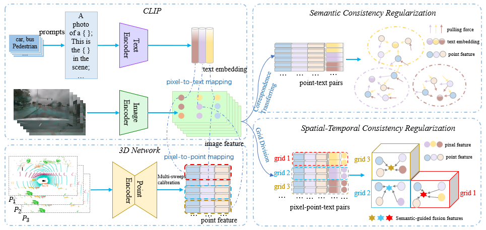

# CLIP2Scene: Towards Label-efficient 3D Scene Understanding by CLIP (CVPR 2023)


CLIP2Scene leverages CLIP knowledge to pre-train a 3D point cloud segmentation network via semantic and spatial-temporal consistency regularization. It yields impressive performance on annotation-free 3D
semantic segmentation and significantly outperforms other self-supervised methods when fine-tuning on annotated data.

[[CVPR 2023 Paper]](https://arxiv.org/pdf/2301.04926.pdf) 

# Installation
**Step 1.** Install PyTorch and Torchvision following [official instructions](https://pytorch.org/get-started/locally/),

```shell
conda install pytorch==1.10.0 torchvision==0.11.0 cudatoolkit=11.3 -c pytorch -c conda-forge
```

**Step 2.** Install [Torchsparse](https://github.com/mit-han-lab/torchsparse) and [MinkowskiEngine](https://github.com/NVIDIA/MinkowskiEngine).
```shell
# MinkowskiEngine
conda install openblas-devel -c anaconda
git clone https://github.com/NVIDIA/MinkowskiEngine.git
cd MinkowskiEngine
pip install ninja
python setup.py install --blas_include_dirs=${CONDA_PREFIX}/include --blas=openblas

# Torchsparse
# refer to https://github.com/PJLab-ADG/PCSeg/blob/master/docs/INSTALL.md
# Make a directory named `torchsparse_dir`
cd package/
mkdir torchsparse_dir/
#Unzip the `.zip` files in `package/`
unzip sparsehash.zip
unzip torchsparse.zip
mv sparsehash-master/ sparsehash/
cd sparsehash/
./configure --prefix=/${ROOT}/package/torchsparse_dir/sphash/
make
make install
#Compile `torchsparse`
cd ..
pip install ./torchsparse
```

**Step 3.** Install CLIP, MaskCLIP, Pytorch_lightning, Nuscenes devkit.
```shell
# Install CLIP (https://github.com/openai/CLIP)
pip install ftfy regex tqdm
pip install git+https://github.com/openai/CLIP.git
# Install MaskCLIP (https://github.com/chongzhou96/MaskCLIP)
pip install -U openmim
mim install mmcv-full==1.4.0
git clone https://github.com/chongzhou96/MaskCLIP.git
cd MaskCLIP
pip install -v -e .
# Install Pytorch_lightning 
pip install pytorch_lightning==1.4.0
# Install Nuscenes devkit 
pip install torchmetrics==0.4.0
pip install nuscenes-devkit==1.1.9
# Note that we should manually add the following function to the class "LidarPointCloud" 
# in "miniconda3/envs/{your environment name}/lib/python{your python version}/site-packages/nuscenes/utils/data_classes.py"
class LidarPointCloud(PointCloud):
    @classmethod
    def from_points(cls, points) -> 'LidarPointCloud':
        return cls(points.T)
```

# Data Preparation
In this paper, we conduct experiments on [ScanNet](http://www.scan-net.org), [Nuscenes](https://www.nuscenes.org/nuscenes#overview), and [SemanticKITTI](http://www.semantic-kitti.org/dataset.html#overview).

**Step 1.** Download the ScanNet, NuScenes and SemanticKITTI dataset. 
```shell
# Pre-processing the scannet dataset
python utils/preprocess_scannet.py
# Obtain nuScenes's sweeps information in (https://github.com/open-mmlab/OpenPCDet/blob/master/docs/GETTING_STARTED.md), and
# save as "nuscenes_infos_dict_10sweeps_train.pkl"
python -m pcdet.datasets.nuscenes.nuscenes_dataset --func create_nuscenes_infos \
    --cfg_file tools/cfgs/dataset_configs/nuscenes_dataset.yaml \
    --version v1.0-trainva

```

**Step 2.** Download and convert the CLIP models,
```shell
python utils/convert_clip_weights.py --model ViT16 --backbone
python utils/convert_clip_weights.py --model ViT16
# obtain ViT16_clip_backbone.pth and ViT16_clip_weights.pth
```

**Step 3.** Prepare the CLIP's text embeddings of the scannet and nuscenes datasets,
```shell
python utils/prompt_engineering.py --model ViT16 --class-set nuscenes
python utils/prompt_engineering.py --model ViT16 --class-set scannet
```

# Pre-training

**ScanNet.** 
```shell
python pretrain.py --cfg_file config/clip2scene_scannet_pretrain.yaml
# The pre-trained model will be saved in /output/clip2scene/scannet/{date}/model.pt
```
**NuScenes.** 
```shell
python pretrain.py --cfg_file config/clip2scene_nuscenes_pretrain.yaml
# The pre-trained model will be saved in /output/clip2scene/nuscenes/{date}/model.pt
```

# Annotation-free

**ScanNet.** 
```shell
python downstream.py --cfg_file config/clip2scene_scannet_label_free.yaml --pretraining_path output/clip2scene/scannet/{date}/model.pt
```
**NuScenes.** 
```shell
python downstream.py --cfg_file config/clip2scene_nuscenes_label_free.yaml --pretraining_path output/clip2scene/nuscenes/{date}/model.pt
```


# Fine-tuning on labeled data

**ScanNet.** 
```shell
python downstream.py --cfg_file config/clip2scene_scannet_finetune.yaml --pretraining_path output/clip2scene/scannet/{date}/model.pt
# The fine-tuned model will be saved in /output/downstream/scannet/{date}/model.pt
```
**NuScenes.** 
```shell
python downstream.py --cfg_file config/clip2scene_nuscenes_finetune.yaml --pretraining_path output/clip2scene/nuscenes/{date}/model.pt
# The fine-tuned model will be saved in /output/downstream/nuscenes/{date}/model.pt
```
**SemanticKITTI.** 
```shell
python downstream.py --cfg_file config/clip2scene_kitti_finetune.yaml --pretraining_path output/clip2scene/nuscenes/{date}/model.pt
# The fine-tuned model will be saved in /output/downstream/kitti/{date}/model.pt
```

# Citation
If you use CLIP2Scene in your work, please cite
```
@inproceedings{chen2023clip2scene,
  title={CLIP2Scene: Towards Label-efficient 3D Scene Understanding by CLIP},
  author={Chen, Runnan and Liu, Youquan and Kong, Lingdong and Zhu, Xinge and Ma, Yuexin and Li, Yikang and Hou, Yuenan and Qiao, Yu and Wang, Wenping},
  booktitle={Proceedings of the IEEE/CVF Conference on Computer Vision and Pattern Recognition},
  pages={7020--7030},
  year={2023}
}
```
**Acknowledgement.** 

Part of the codebase has been adapted from [SLidR](https://github.com/valeoai/SLidR), [MaskCLIP](https://github.com/chongzhou96/MaskCLIP), [PCSeg](https://github.com/PJLab-ADG/PCSeg) and [OpenPCDet](https://github.com/open-mmlab/OpenPCDet).

# Contact
For questions about our paper or code, please contact [Runnan Chen](rnchen2@cs.hku.hk).
